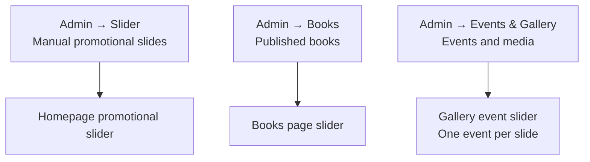

I examined the current implementation. The project is ready for this redesign, and your deleted book-showcase records remove the main data-migration risk.

The final architecture should be:

No content needs to be duplicated between admin sections.

## Confirmed Target Structure

### Homepage

- Restore the former full-background promotional slider appearance.
- Keep the remaining slides:
  - Kitaplarımız
  - Etkinliklerimiz
  - Shopier
- Remove individual book-presentation functionality from Admin → Slider.
- Remove the separate homepage:
  - featured-books cards;
  - recent-events cards;
  - Shopier banner.
- Keep the author/About section underneath the homepage slider.
- Add a compact closing section after the author introduction:
  - Instagram and YouTube links from Site Settings;
  - an `İletişime Geç` button;
  - an optional approved author quotation in the future.
- Do not replace the removed cards with duplicate book, event, or Shopier content.
- Do not invent statistics, awards, testimonials, quotations, or other filler content.
- Retain automatic playback, arrows, dots, swipe support, reduced-motion support, and the separate pause control.

The resulting homepage order will be:

1. General promotional slider.
2. Author introduction.
3. Follow/contact closing section.
4. Footer.

### Books page

- Remove the current card grid.
- Add a dedicated book carousel.
- One published book per slide.
- Each slide contains:
  - book cover;
  - title;
  - shortened description;
  - `Kitabı İncele`;
  - optional `Shopier’den Al`.
- Content comes automatically from Admin → Books.
- `display_order` controls slide order.
- Draft books remain excluded.
- Editing, publishing, unpublishing, or deleting a book automatically updates the carousel.

### Gallery page

- Remove the current event/media grid and filters.
- Add a dedicated event carousel.
- Exactly one event per slide.
- Each slide contains:
  - selected event cover;
  - event title;
  - date;
  - location;
  - description;
  - media count;
  - `Etkinlik Galerisini Aç` action.
- Opening an event shows all photos and videos belonging to that event.
- Photos use the existing accessible lightbox.
- Videos open safely on YouTube.
- The event carousel pauses while the media viewer is open.

The selected `homepage_media_id` will become the event’s general slider cover. In the admin UI, its label should therefore change from “Ana sayfa görseli” to something clearer, such as “Etkinlik kapak görseli.”

Fallback order:

1. Selected event cover photo.
2. First event photo by `display_order`.
3. First video thumbnail.
4. Neutral event placeholder.

## Step-by-Step Implementation Plan

### 1. Remove homepage book-presentation functionality

Update the Slider admin form so it manages promotional slides only:

- Remove `Tanıtım görseli / Kitap tanıtımı` selection.
- Remove the book selector.
- Remove “Belirli bir kitap” from button targets.
- Keep useful promotional destinations:
  - no button;
  - Books page;
  - Gallery;
  - About;
  - Contact;
  - Shopier;
  - external URL.
- Stop querying published books on Slider create/edit/list pages.
- Simplify Slider Server Actions and validation.

Affected areas:

- `HeroSlideForm.tsx`
- Slider create/edit/list pages
- Slider Server Actions
- CTA configuration and tests
- Shared database types

### 2. Clean the obsolete database model

Create a new forward migration. Do not modify the already-applied migration.

Because the book-showcase rows are already deleted, the migration can safely:

- convert any unexpected remaining `cta_type = 'book'` row to `books`;
- remove `book` from the CTA constraint;
- remove `cta_book_id`;
- remove `presentation_type`;
- update `supabase/schema.sql`.

For deployment safety:

1. Deploy code that no longer depends on these columns.
2. Verify the website.
3. Apply the cleanup migration.
4. Reload Supabase’s PostgREST schema cache.

### 3. Restore the homepage promotional slider

Refactor `HeroSlider.tsx` back to the former general presentation:

- one active full-background image;
- dark overlay;
- title, subtitle, and CTA;
- crossfade transition;
- automatic six-second progression;
- arrows and dots;
- touch/swipe support;
- pause when the page is hidden;
- disable automatic movement for reduced-motion users;
- maintain keyboard-accessible controls.

The old visual structure will return, but the newer reliability and accessibility protections will stay.

### 4. Simplify homepage data loading

Update the homepage query:

- Fetch active promotional slides without joining Books.
- Remove `featuredBooks`.
- Remove `recentEvents`.
- Remove obsolete book-presentation filtering and resolution.
- Keep Site Settings and About content.
- Remove the featured-books, recent-events, and standalone Shopier sections.
- Keep the author/About spotlight below the slider.

This ensures that Books, Events, and Shopier promotions appear only through the homepage slider.

### 5. Add the compact homepage closing section

Add a lightweight section below the author introduction instead of adding another content grid.

Behavior:

- Read Instagram and YouTube destinations from Site Settings.
- Render only social links that have actually been configured.
- Include a clear `İletişime Geç` link to `/contact`.
- Keep the section compact and visually quieter than the hero slider.
- Do not introduce a new admin content source for this section.
- Leave room for a client-approved author quotation later, but do not display placeholder quotation text.

This gives the homepage a useful final action without repeating the Books, Gallery, or Shopier promotions already shown in the main slider.

### 6. Build the Books carousel

Add a new `BookSlider` component.

Behavior:

- Render all published books in a horizontally sliding carousel.
- Render all book titles and links in the initial HTML for crawlability.
- Use book covers lazily, except for the first visible cover.
- Provide automatic movement, arrows, dots, swipe, and pause behavior.
- Avoid rendering navigation controls when only one book exists.
- Show an intentional empty state when no books are published.
- Use `<h2>` for individual book titles because the page already has its `<h1>`.

Replace `BookFilter` on `/books`. Remove the old component after confirming nothing else imports it.

### 7. Build the Gallery event carousel

Add:

- `EventGallerySlider`
- an accessible `EventMediaDialog` or equivalent viewer

Each event slide will show only its selected lead media and event information. This avoids loading every gallery photo visibly at the same time.

When the visitor opens an event:

- show that event’s full media collection;
- preserve photo lightbox keyboard behavior;
- open YouTube videos safely;
- trap focus inside the viewer;
- close with Escape;
- restore focus to the event slide;
- pause the outer carousel.

Replace `GalleryFilter` on `/gallery` and remove the old filters/grid after verification.

### 8. Update admin terminology

The existing `homepage_media_id` field is still technically usable, but the interface should no longer describe it as homepage-only.

UI changes:

- “Ana sayfa görseli” → “Etkinlik kapak görseli”
- Explain that it is used as the event’s main Gallery slider image.
- Keep only photos selectable as event covers.
- If the cover is deleted, automatically fall back to the next available media.

Renaming the database column itself is unnecessary and would create avoidable migration risk.

## Required SEO Updates

The existing Phase 4 SEO foundation already covers metadata, canonicals, sitemap, robots, Book structured data, and publishing state. This redesign needs only targeted adjustments.

### Books SEO

- Keep `/books` canonical and metadata.
- Keep individual `/books/[slug]` pages.
- Keep published books in `sitemap.xml`.
- Keep drafts excluded.
- Add accurate `ItemList` JSON-LD to `/books`, linking every published book to its detail page.
- Ensure every book title/link exists in server-rendered HTML.
- Use descriptive book-cover alt text.

### Gallery SEO

- Keep `/gallery` as the only indexed Gallery URL.
- Do not create fake event URLs or carousel URLs.
- Do not add unsupported Event rich-result markup without individual event pages.
- Keep event titles, descriptions, dates, and locations in server-rendered HTML.
- Use event titles for cover-image alt text.

### Homepage SEO

- Homepage metadata and canonical remain unchanged.
- Promotional slider text must not become the only place containing essential author information; the About spotlight remains underneath it.
- Slider positions and fragments must not enter the sitemap.

### Revalidation

Most required revalidation is already correct:

- Book changes revalidate `/books`, book detail pages, and sitemap.
- Event/media changes revalidate `/gallery`.
- Homepage slider changes revalidate `/`.

We will verify these paths during implementation.

## Verification Plan

### Automated checks

- CTA validation after removing specific-book targets.
- Event-cover fallback selection.
- Published/draft book filtering.
- Carousel index wrapping.
- One-slide and empty-state behavior.
- Reduced-motion behavior.
- Existing SEO, slug, storage, and validation tests.
- ESLint, TypeScript, and production build.

### Browser testing

Test at mobile, tablet, desktop, and wide-screen sizes:

- Homepage with the three remaining promotional slides.
- Books page with zero, one, two, and multiple books.
- Very long book titles and descriptions.
- Gallery with zero, one, and multiple events.
- Events with:
  - selected cover;
  - no selected cover;
  - photos only;
  - videos only;
  - mixed media;
  - missing/deleted media.
- Autoplay, arrows, dots, swipe, keyboard navigation, pause, and reduced motion.
- Photo lightbox and YouTube behavior.
- No horizontal overflow or layout shifting.

## Implementation Order

1. Simplify database/types and Slider admin code.
2. Restore the homepage promotional slider.
3. Remove duplicate homepage sections.
4. Add the compact social/contact closing section.
5. Implement the Books carousel.
6. Implement the Gallery event carousel and media viewer.
7. Rename the event-cover admin terminology.
8. Add targeted Books SEO markup.
9. Update the Phase 4 plan and migration documentation.
10. Run automated and browser verification.
11. Deploy the compatible code.
12. Apply the cleanup migration and perform a production smoke test.

No additional client content is required to implement this. The sliders will remain fully dynamic, so future book, event, media, or promotional-slide changes made through the admin panel will update the appropriate carousel automatically.
